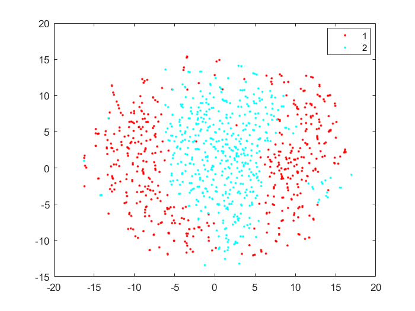
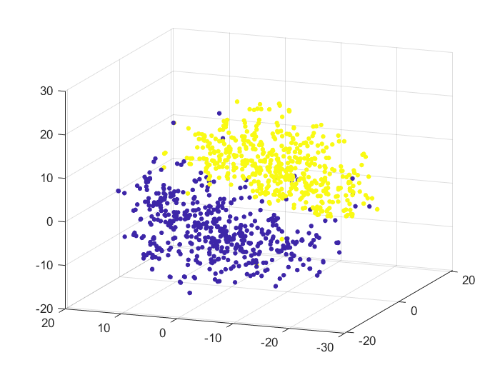

# tsne-plotter   
This is Matlab script for plotting 2 Dimensional and 3 Dimensional t-Distributed Stochastic Neighbor Embedding (t-SNE)

<strong>t-Distributed Stochastic Neighbor Embedding (t-SNE) </strong> is a (prize-winning) technique for dimensionality reduction that is particularly well suited for the visualization of high-dimensional datasets. The technique can be implemented via Barnes-Hut approximations, allowing it to be applied on large real-world datasets. For more information, check this [page](https://lvdmaaten.github.io/tsne/).

## How to use?
1.  Clone this repository.
2.  How the Dataset and label should be arranged ?
    1. The script requires two inputs - `Data` and `Label`.
    2. Arrangement of  `Data`  - First column should be "label name" and rest of the columns should be "features".
    3. Arrangement of  `Label` - First column should be "label name" , which should be in the same order as `Data`'s label names.
    4. Each row in both `Data` and `Label` is a sample.
3. Replace the `Data` and `Label` in folder `inputs` directory with the same name.
4. Run the script `tsne_example.m`.
5. The code will generate both 2D and 3D t-sne plots.

Examples of `Data`,`Label` and `t-sne plots` have been included with this repository. Sample 2D and 3D t-sne plots for the given sample inputs are as follows :

 

## Issue / Want to Contribute ? :
Open a new issue or do a pull request incase your are facing any difficulty with the code base or you want to contribute to it.

